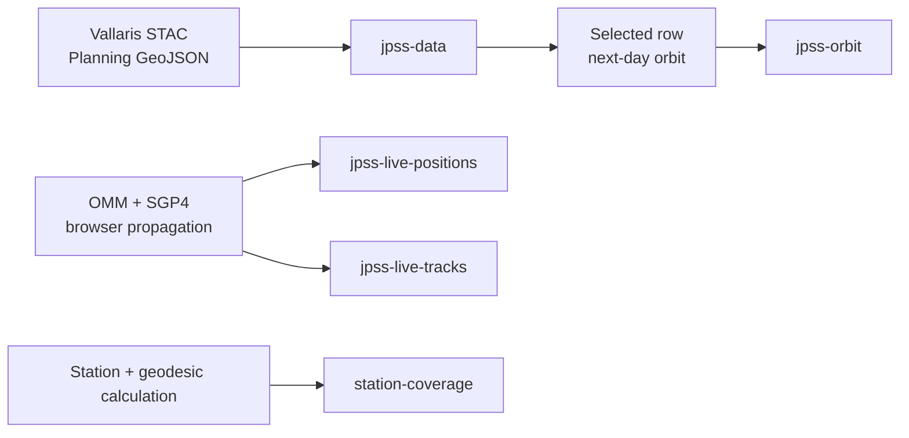

# 🗺️ Map Layers และรหัสสี

เอกสารอ้างอิง MapLibre sources, layers และสีที่ใช้จริงในเว็บ **JPSS Planning Map**

[เปิดเว็บไซต์](https://gung-prn.github.io/planning_jpss/) · [กลับไป README](README.md) · [Live JPSS](live_jpss.md)

## สัญญาข้อมูลแผนที่

| รายการ | ค่า |
|---|---|
| Map renderer | MapLibre GL JS 4.7.1 |
| Basemap style | `https://carto.elemnt.earth/2026-06-22_axolotl/style.json` |
| CRS ของ GeoJSON | OGC:CRS84 |
| ลำดับพิกัด | `[longitude, latitude]` |
| จุดกึ่งกลางเริ่มต้น | `[100.929, 13.1014]` |
| Zoom เริ่มต้น | 5 |
| Coverage radius | 2,500 km |
| Fixed corridor | 250 km |

> [!IMPORTANT]
> พิกัด GeoJSON ทุก source ที่เว็บสร้างหรือโหลดต้องเรียงเป็น `[longitude, latitude]` ไม่ใช่ `[latitude, longitude]`

## ภาพรวม Sources



| Source ID | Geometry | ที่มา | อัปเดตเมื่อ |
|---|---|---|---|
| `station-coverage` | Polygon | วงกลม geodesic จากสถานี รัศมี 2,500 km | ตอนเปิดเว็บ |
| `jpss-live-tracks` | LineString/MultiLineString | OMM + SGP4 ใน browser | ทุก 10 วินาที |
| `jpss-live-positions` | Point | OMM + SGP4 ใน browser | ทุก 1 วินาที |
| `jpss-data` | LineString และ Point | Planning GeoJSON จาก STAC dataset วันที่เลือก | เมื่อเลือกวันที่ |
| `jpss-orbit` | LineString และ Polygon | Pass วันถัดไป + corridor ที่สร้างใน browser | เมื่อคลิกแถว Planning |

## Layer stack

MapLibre วาด layer ที่เพิ่มภายหลังไว้เหนือ layer ก่อนหน้า ลำดับจากล่างขึ้นบนคือ:

```text
13  live-satellite-label
12  live-satellite-symbol
11  live-satellite-anchor
10  orbit-line
 9  orbit-corridor-line
 8  orbit-corridor-fill
 7  selected-event-circle
 6  selected-track-line
 5  event-circle
 4  track-line
 3  live-satellite-track-line
 2  coverage-buffer-line
 1  coverage-buffer-fill
```

ลำดับนี้ทำให้ icon ดาวเทียมและ planning ที่เลือกอยู่ด้านบน ขณะที่ Coverage และเส้น live track อ่อน ๆ อยู่ด้านหลัง

## Layers ที่ใช้งานจริง

### Coverage buffer

| Layer ID | Type | Source | Style | สถานะเริ่มต้น |
|---|---|---|---|---|
| `coverage-buffer-fill` | fill | `station-coverage` | `#66758a`, opacity `0.07` | เปิด |
| `coverage-buffer-line` | line | `station-coverage` | `#66758a`, width `2`, dash `[4,3]`, opacity `0.9` | เปิด |

ควบคุมด้วย checkbox **Coverage buffer** ใน Extra layers

### Planning visible tracks

| Layer ID | Type | Filter | สี/Style | สถานะเริ่มต้น |
|---|---|---|---|---|
| `track-line` | line | `type = visible_track` | Ascending `#0d69ba`, Descending `#7655d9`, width `3`, opacity `0.9` | เปิด |
| `selected-track-line` | line | `pass_id` ของแถวที่เลือก | สีเดียวกับ direction, width `6`, opacity `1` | ไม่มี feature จนกว่าจะเลือกแถว |

เมื่อเลือกแถว Planning:

- `track-line` อื่นลด opacity จาก `0.9` เหลือ `0.16`
- `selected-track-line` แสดงทับด้วย width `6` และ opacity `1`
- คลิกแถวเดิมอีกครั้งหรือกด `Escape` จะยกเลิก highlight

### AOS / TCA / LOS

| Layer ID | Type | Filter | Style | สถานะเริ่มต้น |
|---|---|---|---|---|
| `event-circle` | circle | `type in [aos,tca,los]` | radius `6`, stroke ขาว `2` | เปิด |
| `selected-event-circle` | circle | `pass_id` ของแถวที่เลือก | radius `9`, stroke ขาว `3`, opacity `1` | ไม่มี feature จนกว่าจะเลือกแถว |

สีของ event:

| Event | Token | HEX | ความหมาย |
|---|---|---|---|
| AOS | `--color-map-aos` | `#00a6d6` | Acquisition of Signal |
| TCA | `--color-map-tca` | `#e4b52b` | Time of Closest Approach |
| LOS | `--color-map-los` | `#2f9e44` | Loss of Signal |
| Stroke/Halo | `--color-map-halo` | `#ffffff` | ขอบแยกจุดออกจาก basemap |

เมื่อเลือกแถว จุดของ Pass อื่นลด opacity เหลือ `0.22` และ stroke opacity เหลือ `0.25`

### Orbit +1 day และ Fixed corridor

| Layer ID | Type | Filter | Style | การแสดงผล |
|---|---|---|---|---|
| `orbit-corridor-fill` | fill | `type = orbit_corridor` | `#c2410c`, opacity `0.16` | เมื่อเลือกแถวและเปิด Corridor |
| `orbit-corridor-line` | line | `type = orbit_corridor` | `#c2410c`, width `1`, opacity `0.65` | เมื่อเลือกแถวและเปิด Corridor |
| `orbit-line` | line | `type = orbit` | `#c2410c`, width `3`, dash `[1,1]` | เมื่อเลือกแถวที่มีข้อมูลวันถัดไป |

พฤติกรรมสำคัญ:

- หน้าเว็บเริ่มต้นด้วย source ว่าง จึงยังไม่แสดง orbit/corridor
- คลิกแถว Planning แล้วเว็บหา Pass ของดาวเทียมและ direction เดียวกันที่ใกล้ `TCA + 1 วัน` ที่สุด
- เส้น orbit แสดงเฉพาะส่วนที่อยู่ใน Coverage 2,500 km หากมีจุดที่ clip ได้อย่างน้อย 2 จุด
- corridor มีขนาดคงที่ 250 km
- checkbox Corridor ถูกเปิดเป็นค่าเริ่มต้น แต่ corridor จะปรากฏต่อเมื่อมี Planning ที่เลือก

> [!NOTE]
> Map layer ของ corridor ใช้สี `--color-map-orbit` (`#c2410c`) ส่วน token `--color-map-corridor` (`#d47842`) ใช้กับ swatch ใน UI ไม่ได้ใช้เป็น `fill-color` ของ MapLibre layer ปัจจุบัน

### Live JPSS tracks

| Layer ID | Type | Source | Style | สถานะเริ่มต้น |
|---|---|---|---|---|
| `live-satellite-track-line` | line | `jpss-live-tracks` | width `2`, opacity `0.26`, blur `0.25` | เปิด |

สีแยกตาม `satellite_id`:

| ดาวเทียม | Token | HEX |
|---|---|---|
| Suomi-NPP | `--color-map-satellite-npp` | `#008ea8` |
| NOAA 20 (JPSS-1) | `--color-map-satellite-jpss1` | `#d9500f` |
| NOAA 21 (JPSS-2) | `--color-map-satellite-jpss2` | `#6547c7` |

### Live JPSS positions

| Layer ID | Type | Source | Style/หน้าที่ |
|---|---|---|---|
| `live-satellite-anchor` | circle | `jpss-live-positions` | radius `4`, สีตามดาวเทียม, stroke ขาว `1.5`; เพิ่มพื้นที่คลิก |
| `live-satellite-symbol` | symbol | `jpss-live-positions` | SVG icon size `0.5`, หมุนตาม `bearing`, alignment กับ map |
| `live-satellite-label` | symbol | `jpss-live-positions` | label NPP/JPSS-1/JPSS-2, size `0.5`, offset `[0,66]`, alignment กับ viewport |

checkbox **Live JPSS positions** ควบคุมทั้ง 4 layers พร้อมกัน ได้แก่ track, anchor, symbol และ label

## ตารางรหัสสีทั้งหมด

สีประกาศใน [`tokens.css`](tokens.css) และอ่านเข้า `MAP_COLORS` ใน [`index.html`](index.html)

### สีที่ MapLibre layers ใช้งานจริง

| Token | HEX | ใช้กับ |
|---|---|---|
| `--color-map-track` | `#0d69ba` | Ascending planning track |
| `--color-map-descending` | `#7655d9` | Descending planning track |
| `--color-map-buffer` | `#66758a` | Coverage fill/outline |
| `--color-map-aos` | `#00a6d6` | AOS point |
| `--color-map-tca` | `#e4b52b` | TCA point |
| `--color-map-los` | `#2f9e44` | LOS point |
| `--color-map-orbit` | `#c2410c` | Orbit +1 day และ corridor |
| `--color-map-halo` | `#ffffff` | Stroke ของ event และ live anchor |
| `--color-map-satellite-npp` | `#008ea8` | Suomi-NPP live track/icon |
| `--color-map-satellite-jpss1` | `#d9500f` | JPSS-1 live track/icon |
| `--color-map-satellite-jpss2` | `#6547c7` | JPSS-2 live track/icon |

### Tokens ที่เตรียมไว้ แต่ยังไม่เป็น MapLibre layer ปัจจุบัน

| Token | HEX | สถานะปัจจุบัน |
|---|---|---|
| `--color-map-swath` | `#f4bf38` | เตรียมไว้สำหรับ SWATH/legend |
| `--color-map-swath-covered` | `#e86412` | เตรียมไว้สำหรับ covered SWATH |
| `--color-map-swath-outline` | `#d9500f` | เตรียมไว้สำหรับ SWATH outline |
| `--color-map-swath-outline-idle` | `#d99a05` | เตรียมไว้สำหรับ SWATH idle outline |
| `--color-map-aoi` | `#d92d20` | เตรียมไว้สำหรับ AOI |
| `--color-map-aoi-soft` | `#ff8787` | เตรียมไว้สำหรับ AOI soft/halo |
| `--color-map-station` | `#c92319` | เตรียมไว้สำหรับจุดสถานี |
| `--color-map-corridor` | `#d47842` | ใช้ใน UI swatch; map corridor ใช้สี orbit |

## Default visibility

| กลุ่ม | ค่าเริ่มต้น | หมายเหตุ |
|---|---|---|
| Tracks | เปิด | รวม base และ selected overlay |
| AOS/TCA/LOS | เปิด | รวม base และ selected overlay |
| Coverage buffer | เปิด | fill และ outline |
| Live JPSS | เปิด | track, anchor, icon และ label |
| Orbit +1 day | ซ่อน | แสดงเมื่อคลิกแถวและพบ dataset วันถัดไป |
| Fixed corridor | พร้อมเปิด | checkbox เปิด แต่ต้องเลือกแถวก่อน |

## Checklist เมื่อเพิ่มหรือแก้ Layer

- [ ] Source geometry ตรงกับ layer type
- [ ] GeoJSON ใช้ CRS84 และ `[longitude, latitude]`
- [ ] สีอ้างผ่าน token ใน `tokens.css`
- [ ] Layer ID ไม่ซ้ำและอยู่ใน stack order ที่ต้องการ
- [ ] ระบุ filter จาก properties อย่างชัดเจน
- [ ] มีค่า default visibility และ toggle ที่สอดคล้องกัน
- [ ] ทดสอบ selected/unselected opacity
- [ ] ทดสอบ popup hit target และ cursor
- [ ] ทดสอบเส้นข้าม antimeridian
- [ ] ตรวจ contrast บน basemap หลายระดับ zoom
