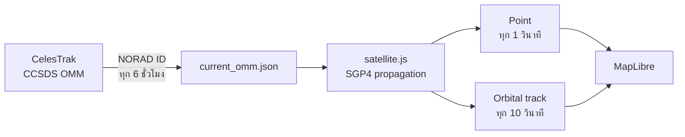
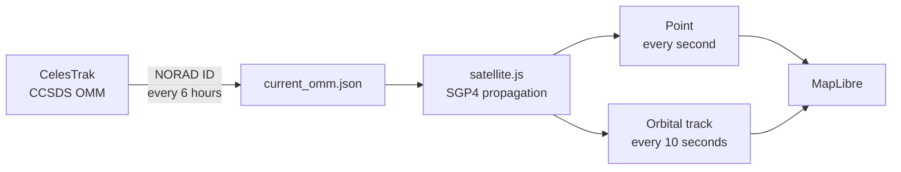

# 🛰️ JPSS Planning Map

เว็บแผนการรับสัญญาณและติดตามตำแหน่งดาวเทียม **Suomi-NPP, NOAA 20 (JPSS-1) และ NOAA 21 (JPSS-2)** ด้วยข้อมูล Vallaris STAC, CelesTrak OMM, SGP4 และ MapLibre

[เปิดเว็บไซต์](https://gung-prn.github.io/planning_jpss/) · [ภาษาไทย](#ภาษาไทย) · [English](#english) · [Map Layers & Colors](MAP_LAYERS.md) · [Live JPSS ฉบับเต็ม](live_jpss.md) · [Full English guide](live_jpss_en.md)

---

## ภาษาไทย

### ความสามารถหลัก

- เลือกวันที่ Planning จากปฏิทิน
- แสดง Pass ของ JPSS ทั้ง 3 ดวงในตารางเดียว
- คลิกแถวเพื่อเน้นเส้น Pass, orbit วันถัดไป และ fixed corridor
- แสดงตำแหน่งปัจจุบันพร้อม icon และทิศทางการเคลื่อนที่
- แสดงเส้นวงโคจรรอบเวลาปัจจุบันแยกรายดาวเทียม
- โหลดข้อมูล Planning จาก Vallaris STAC และ sync เป็นข้อมูลสำหรับเว็บ

### Live JPSS ทำงานอย่างไร



> [!IMPORTANT]
> ตำแหน่ง Live JPSS เป็นค่าคำนวณจาก **OMM + SGP4** ไม่ใช่ telemetry หรือ GPS ที่ส่งตรงจากตัวดาวเทียม

### ดาวเทียมและแหล่งข้อมูล

| `satellite_id` | ชื่อ | NORAD ID | Object ID |
|---|---|---:|---|
| `suomi_npp` | SUOMI NPP | 37849 | 2011-061A |
| `jpss_1` | NOAA 20 (JPSS-1) | 43013 | 2017-073A |
| `jpss_2` | NOAA 21 (JPSS-2) | 54234 | 2022-150A |

OMM ถูกดึงจาก CelesTrak General Perturbations API:

```text
https://celestrak.org/NORAD/elements/gp.php?CATNR={norad_id}&FORMAT=JSON
```

สคริปต์ [`scripts/sync_jpss_current_omm.py`](scripts/sync_jpss_current_omm.py) ตรวจ NORAD ID, ค่าพารามิเตอร์วงโคจร, ช่วง inclination/eccentricity/mean motion และปฏิเสธ OMM ที่เก่ากว่า 7 วันก่อนเผยแพร่ [`satellite_data/current_omm.json`](satellite_data/current_omm.json)

### สัญญาข้อมูลเชิงพื้นที่และเวลา

| รายการ | ค่า |
|---|---|
| แบบจำลอง | SGP4 ผ่าน `satellite.js` 6.0.2 |
| เวลาอ้างอิง | UTC |
| CRS | OGC:CRS84 |
| ลำดับพิกัด | `[longitude, latitude]` |
| ตำแหน่ง | GeoJSON Point |
| เส้นวงโคจร | GeoJSON LineString/MultiLineString |
| Altitude | กิโลเมตร |
| Telemetry | `false` |

#### เวลาที่ควรดูใน popup

- `Calculated UTC` คือเวลาที่ browser ใช้คำนวณตำแหน่งปัจจุบัน และควรเปลี่ยนทุกวินาที
- `OMM epoch` คือเวลาอ้างอิงของ orbital elements จาก CelesTrak และจะไม่เปลี่ยนจนกว่าจะ sync ชุดใหม่
- `generated_at` คือเวลาที่ workflow สร้าง OMM snapshot

### การคำนวณตำแหน่ง

เว็บแปลง OMM ด้วย `satellite.json2satrec()` แล้วใช้ `satellite.propagate()` คำนวณ ECI position ณ เวลา UTC จากนั้นแปลงเป็น longitude, latitude และ altitude ก่อนสร้าง GeoJSON Point

ตำแหน่งจะผ่านการตรวจสอบ:

- longitude: -180° ถึง 180°
- latitude: -90° ถึง 90°
- altitude: 100 ถึง 2,000 km

ทิศทาง icon คำนวณจากตำแหน่งปัจจุบันไปยังตำแหน่งในอนาคต 5 วินาที และมีการ unwrap bearing เพื่อไม่ให้ icon หมุนย้อนรอบเมื่อค่าข้าม 359° → 0°

### การสร้างเส้นวงโคจรแต่ละดาวเทียม

เส้น live orbit สร้างใน browser จาก OMM ไม่ได้ดาวน์โหลดเป็นไฟล์เส้นสำเร็จรูป

| การตั้งค่า | ค่า |
|---|---:|
| ตำแหน่งย้อนหลัง | 10 นาที |
| ตำแหน่งล่วงหน้า | 100 นาที |
| ระยะห่างการคำนวณ | 15 วินาที |
| รอบอัปเดตตำแหน่ง | 1 วินาที |
| รอบสร้างเส้นใหม่ | 10 วินาที |

สร้าง 1 feature ต่อดาวเทียมและแยกเส้นที่ข้าม antimeridian เป็น `MultiLineString` เพื่อป้องกันเส้นลากพาดข้ามกึ่งกลางแผนที่

> [!NOTE]
> property `live_tle_track` ถูกเก็บไว้เพื่อรองรับ UI เดิม แต่ข้อมูลต้นทางของเส้น live คือ **OMM** และคำนวณด้วย **SGP4**

### MapLibre sources และ layers

| Source/Layer | หน้าที่ |
|---|---|
| `jpss-live-positions` | GeoJSON Point ของตำแหน่งปัจจุบัน |
| `jpss-live-tracks` | เส้นวงโคจรแยกรายดาวเทียม |
| `live-satellite-track-line` | เส้นวงโคจร opacity ต่ำ |
| `live-satellite-anchor` | จุดรองรับพื้นที่คลิก |
| `live-satellite-symbol` | SVG icon หมุนตาม bearing |
| `live-satellite-label` | ชื่อ NPP, JPSS-1 หรือ JPSS-2 |

### การอัปเดตอัตโนมัติ

workflow `.github/workflows/sync-jpss-current-omm.yml` ทำงานทุก 6 ชั่วโมงที่นาที 17 UTC หรือสั่งด้วย `workflow_dispatch` จากนั้น GitHub Pages จะ deploy snapshot ที่ sync สำเร็จ

รันจากเครื่อง:

```bash
python3 scripts/sync_jpss_current_omm.py
python3 -m json.tool satellite_data/current_omm.json
```

### Checklist

- [ ] `generated_at` ตรงกับ workflow รอบล่าสุด
- [ ] OMM epoch ของแต่ละดาวไม่เก่ากว่า 7 วัน
- [ ] `Calculated UTC` ใน popup เปลี่ยนทุกวินาที
- [ ] พิกัดอยู่ในช่วง CRS84 และเรียง `[longitude, latitude]`
- [ ] icon อยู่บนเส้นสีเดียวกันในทุกระดับ zoom
- [ ] เส้นข้าม antimeridian ไม่ลากพาดกลางแผนที่
- [ ] ปิด Live JPSS แล้ว Point, icon, label และเส้นถูกซ่อนพร้อมกัน

อ่านรายละเอียดทั้งหมดได้ที่ [live_jpss.md](live_jpss.md)

---

## English

### Key capabilities

- Select a planning date from the calendar.
- Display all three JPSS satellites in one pass table.
- Select a row to highlight its pass, next-day orbit, and fixed corridor.
- Render current satellite positions with directional icons.
- Render a separate current-time orbital track for each satellite.
- Load planning data from Vallaris STAC and synchronize it for the static web client.

### Live tracking architecture



> [!IMPORTANT]
> Live JPSS locations are **OMM/SGP4 predictions**, not direct spacecraft telemetry or onboard GPS observations.

### Satellites and source data

| `satellite_id` | Name | NORAD ID | Object ID |
|---|---|---:|---|
| `suomi_npp` | SUOMI NPP | 37849 | 2011-061A |
| `jpss_1` | NOAA 20 (JPSS-1) | 43013 | 2017-073A |
| `jpss_2` | NOAA 21 (JPSS-2) | 54234 | 2022-150A |

OMM records are retrieved from the CelesTrak General Perturbations API. [`scripts/sync_jpss_current_omm.py`](scripts/sync_jpss_current_omm.py) validates identity, orbital parameters, value ranges, and OMM age before publishing [`satellite_data/current_omm.json`](satellite_data/current_omm.json).

### Spatial and temporal contract

| Item | Value |
|---|---|
| Propagator | SGP4 through `satellite.js` 6.0.2 |
| Temporal reference | UTC |
| CRS | OGC:CRS84 |
| Coordinate order | `[longitude, latitude]` |
| Position geometry | GeoJSON Point |
| Track geometry | GeoJSON LineString/MultiLineString |
| Altitude unit | kilometers |
| Telemetry | `false` |

#### Popup timestamps

- `Calculated UTC` is the timestamp propagated by the browser and should advance every second.
- `OMM epoch` is the reference time of the source orbital elements and remains fixed until a newer OMM set is synchronized.
- `generated_at` is when the workflow created the static OMM snapshot.

### Position and track generation

The browser converts each OMM record with `satellite.json2satrec()`, propagates it with `satellite.propagate()`, transforms ECI into geodetic coordinates, validates the result, and emits a CRS84 GeoJSON Point.

Icon direction uses a second propagated position five seconds in the future. The client unwraps bearing changes around 359° → 0° to keep rotation continuous.

Tracks are generated in the browser rather than downloaded as line files:

| Setting | Value |
|---|---:|
| Track history | 10 minutes |
| Track prediction | 100 minutes |
| Sampling interval | 15 seconds |
| Position refresh | 1 second |
| Track rebuild | 10 seconds |

One feature is generated per satellite. Antimeridian crossings are split into a `MultiLineString` so MapLibre does not draw an invalid line across the center of the world map.

### MapLibre sources and layers

| Source/Layer | Responsibility |
|---|---|
| `jpss-live-positions` | Current-position GeoJSON Points |
| `jpss-live-tracks` | Per-satellite orbital tracks |
| `live-satellite-track-line` | Low-opacity orbital lines |
| `live-satellite-anchor` | Stable pointer target |
| `live-satellite-symbol` | Bearing-rotated SVG icon |
| `live-satellite-label` | NPP, JPSS-1, or JPSS-2 label |

### Automated updates

`.github/workflows/sync-jpss-current-omm.yml` runs every six hours at minute 17 UTC or on `workflow_dispatch`. A successful synchronization is followed by a GitHub Pages deployment.

Run locally:

```bash
python3 scripts/sync_jpss_current_omm.py
python3 -m json.tool satellite_data/current_omm.json
```

### Checklist

- [ ] `generated_at` belongs to the latest synchronization run.
- [ ] Every OMM epoch is no more than seven days old.
- [ ] Popup `Calculated UTC` advances every second.
- [ ] Coordinates are valid CRS84 `[longitude, latitude]` values.
- [ ] Every icon remains aligned with the track of the same color at all zoom levels.
- [ ] Antimeridian crossings do not draw across the center of the map.
- [ ] Turning off Live JPSS hides points, icons, labels, and tracks together.

See [live_jpss_en.md](live_jpss_en.md) for the full English guide.

---

## License and data provenance

- Orbital elements: [CelesTrak](https://celestrak.org/)
- Propagation: [satellite.js](https://github.com/shashwatak/satellite-js)
- Map rendering: [MapLibre GL JS](https://maplibre.org/)
- Planning catalog: Vallaris STAC

Use propagated positions as planning-support information. They are not a substitute for authoritative operational telemetry.
