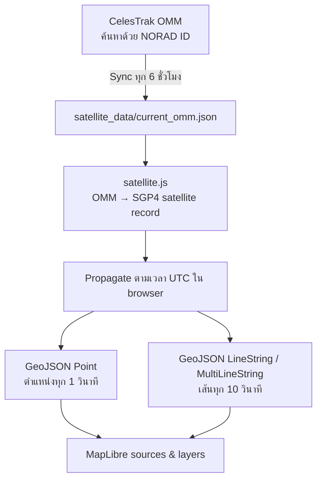

# 🛰️ การแสดงตำแหน่งและเส้นวงโคจร Live JPSS

**ภาษาไทย** · [English](live_jpss_en.md)

> เอกสารอธิบายวิธีที่เว็บ **JPSS Planning** ดึง OMM ล่าสุด คำนวณตำแหน่งดาวเทียมด้วย SGP4 และสร้างเส้นวงโคจรของดาวเทียมแต่ละดวงบน MapLibre

| รายการ | ข้อกำหนด |
|---|---|
| ดาวเทียม | Suomi-NPP · NOAA 20 (JPSS-1) · NOAA 21 (JPSS-2) |
| แหล่งข้อมูล | CelesTrak CCSDS OMM |
| แบบจำลอง | SGP4 ผ่าน `satellite.js` 6.0.2 |
| เวลาอ้างอิง | UTC |
| CRS | OGC:CRS84 |
| ลำดับพิกัด | `[longitude, latitude]` |
| ตำแหน่ง | GeoJSON Point · อัปเดตทุก 1 วินาที |
| เส้นวงโคจร | LineString/MultiLineString · อัปเดตทุก 10 วินาที |

## สารบัญ

- [ภาพรวมกระบวนการ](#ภาพรวมกระบวนการ)
- [1. แหล่งข้อมูลวงโคจร](#1-แหล่งข้อมูลวงโคจร)
- [2. โครงสร้างข้อมูลที่เว็บใช้](#2-โครงสร้างข้อมูลที่เว็บใช้)
- [3. การคำนวณตำแหน่งดาวเทียม](#3-การคำนวณตำแหน่งดาวเทียม)
- [4. การสร้างเส้นวงโคจร](#4-การสร้างเส้นวงโคจรของแต่ละดาวเทียม)
- [5. การแสดงผลบน MapLibre](#5-การแสดงผลบน-maplibre)
- [6. การอัปเดตข้อมูลอัตโนมัติ](#6-การอัปเดตข้อมูลอัตโนมัติ)
- [7. Checklist การตรวจสอบ](#7-การตรวจสอบว่า-live-tracking-ทำงานถูกต้อง)
- [ข้อจำกัด](#ข้อจำกัด)

## ภาพรวมกระบวนการ



> [!IMPORTANT]
> ตำแหน่งที่แสดงเป็นค่าจากแบบจำลอง **SGP4** ไม่ใช่ telemetry หรือ GPS ที่ส่งตรงจากตัวดาวเทียม

## 1. แหล่งข้อมูลวงโคจร

ใช้ข้อมูล CCSDS OMM (Orbit Mean-Elements Message) จาก CelesTrak ผ่าน General Perturbations API:

```text
https://celestrak.org/NORAD/elements/gp.php?CATNR={norad_id}&FORMAT=JSON
```

ดาวเทียมที่ติดตามมี 3 ดวง:

| `satellite_id` | ชื่อแสดงผล | NORAD ID | Object ID |
|---|---|---:|---|
| `suomi_npp` | SUOMI NPP | 37849 | 2011-061A |
| `jpss_1` | NOAA 20 (JPSS-1) | 43013 | 2017-073A |
| `jpss_2` | NOAA 21 (JPSS-2) | 54234 | 2022-150A |

สคริปต์ที่ใช้ดึงข้อมูลคือ [`scripts/sync_jpss_current_omm.py`](scripts/sync_jpss_current_omm.py)

### การตรวจสอบ OMM ก่อนเผยแพร่

สคริปต์ตรวจสอบเงื่อนไขต่อไปนี้ก่อนเขียนไฟล์:

- CelesTrak ต้องตอบกลับมา 1 OMM record ต่อ NORAD ID
- `NORAD_CAT_ID` ต้องตรงกับดาวเทียมที่ร้องขอ
- พารามิเตอร์วงโคจรที่จำเป็นต้องเป็นตัวเลข finite
- `MEAN_MOTION` ต้องอยู่ระหว่าง 10–20 รอบต่อวัน
- `ECCENTRICITY` ต้องอยู่ในช่วง `0 ≤ e < 1`
- `INCLINATION` ต้องอยู่ในช่วง 0–180 องศา
- OMM epoch ต้องไม่อยู่ในอนาคตเกิน 1 ชั่วโมง
- OMM ต้องมีอายุไม่เกิน 7 วัน
- การเรียก API retry สูงสุด 3 ครั้งสำหรับ HTTP 429, 5xx และ network error

ไฟล์ผลลัพธ์ถูกเขียนแบบ atomic replace เพื่อลดโอกาสที่เว็บจะอ่าน JSON ซึ่งเขียนไม่สมบูรณ์

## 2. โครงสร้างข้อมูลที่เว็บใช้

ผลลัพธ์ถูกบันทึกไว้ที่ [`satellite_data/current_omm.json`](satellite_data/current_omm.json) โดยมีโครงสร้างหลักดังนี้:

```json
{
  "generated_at": "2026-08-23T16:49:28Z",
  "position_contract": {
    "method": "Browser-side SGP4 propagation from the latest OMM",
    "temporal_reference": "UTC",
    "crs": "OGC:CRS84",
    "coordinate_order": ["longitude", "latitude"],
    "altitude_unit": "km",
    "telemetry": false
  },
  "satellites": [
    {
      "satellite_id": "suomi_npp",
      "norad_id": 37849,
      "epoch_utc": "2026-08-23T07:14:55Z",
      "age_hours_at_sync": 9.58,
      "omm": {}
    }
  ]
}
```

ความหมายของเวลาที่สำคัญ:

- `generated_at` คือเวลาที่ workflow สร้าง snapshot
- `epoch_utc` หรือ `omm.EPOCH` คือเวลาอ้างอิงของ orbital elements จาก CelesTrak ไม่ใช่เวลาปัจจุบัน
- `calculated_at` คือเวลาที่ browser ใช้คำนวณตำแหน่งปัจจุบัน

> [!TIP]
> หากต้องการตรวจว่าเว็บกำลังคำนวณตำแหน่งแบบ live ให้ดู `Calculated UTC` ใน popup ซึ่งต้องเปลี่ยนทุกวินาที ส่วน `OMM epoch` จะคงเดิมจนกว่าจะ sync orbital elements ชุดใหม่

## 3. การคำนวณตำแหน่งดาวเทียม

หน้าเว็บโหลด `satellite.js` เวอร์ชัน 6.0.2 และทำงานตามลำดับนี้:

1. โหลด `satellite_data/current_omm.json`
2. ตรวจว่ามีดาวเทียมครบ 3 ดวงและ CRS เป็น `OGC:CRS84`
3. แปลง `record.omm` เป็น satellite record ด้วย `satellite.json2satrec()`
4. ใช้ `satellite.propagate(satrec, date)` คำนวณ ECI position ณ เวลา UTC ที่ต้องการ
5. ใช้ Greenwich sidereal time แปลง ECI เป็น geodetic longitude, latitude และ altitude
6. ตรวจสอบช่วงค่าก่อนนำไปสร้าง GeoJSON:
   - longitude: -180 ถึง 180 องศา
   - latitude: -90 ถึง 90 องศา
   - altitude: 100 ถึง 2,000 กิโลเมตร

ตำแหน่งปัจจุบันถูกคำนวณใหม่ทุก 1 วินาที และถูกสร้างเป็น GeoJSON Point:

```json
{
  "type": "Feature",
  "id": "suomi_npp",
  "properties": {
    "type": "live_satellite_position",
    "satellite_id": "suomi_npp",
    "calculated_at": "2026-08-23T18:03:43.670Z",
    "altitude_km": 830.6,
    "source": "CelesTrak OMM / SGP4"
  },
  "geometry": {
    "type": "Point",
    "coordinates": [120.1515, 38.1832]
  }
}
```

พิกัด GeoJSON ใช้ CRS84 และเรียงเป็น `[longitude, latitude]`

### การคำนวณทิศทางของ icon

เว็บคำนวณตำแหน่งอีกครั้งที่เวลาอนาคต 5 วินาที แล้วคำนวณ initial bearing จากตำแหน่งปัจจุบันไปยังตำแหน่งนั้น ค่า bearing ใช้หมุน icon ดาวเทียมให้หันไปตามทิศทางการเคลื่อนที่

มีการ unwrap มุม bearing ระหว่างรอบอัปเดต เพื่อไม่ให้ icon หมุนย้อนรอบเมื่อค่าข้ามจาก 359° ไป 0°

## 4. การสร้างเส้นวงโคจรของแต่ละดาวเทียม

เส้น live orbit ไม่ได้ถูกดาวน์โหลดเป็นไฟล์เส้นจาก CelesTrak แต่สร้างใน browser จาก OMM ของดาวเทียมแต่ละดวง:

1. กำหนดเวลาศูนย์กลางเป็นเวลาปัจจุบัน
2. เริ่มเส้นย้อนหลังจากเวลาปัจจุบัน 10 นาที
3. สิ้นสุดเส้นที่เวลาปัจจุบัน +100 นาที
4. คำนวณตำแหน่งด้วย SGP4 ทุกช่วง 15 วินาที
5. เก็บตำแหน่งเป็น `[longitude, latitude]`
6. สร้าง 1 GeoJSON feature ต่อดาวเทียม
7. อัปเดตชุดเส้นใหม่ทุก 10 วินาที

ค่าควบคุมใน [`index.html`](index.html):

| ตัวแปร | ค่า | ความหมาย |
|---|---:|---|
| `LIVE_POSITION_INTERVAL_MS` | 1,000 ms | รอบอัปเดตตำแหน่ง Point |
| `LIVE_POSITION_LOOKAHEAD_MS` | 5,000 ms | ช่วงเวลาอนาคตสำหรับคำนวณ bearing |
| `LIVE_TRACK_PAST_MINUTES` | 10 นาที | ความยาวเส้นย้อนหลัง |
| `LIVE_TRACK_FUTURE_MINUTES` | 100 นาที | ความยาวเส้นไปข้างหน้า |
| `LIVE_TRACK_STEP_SECONDS` | 15 วินาที | ระยะห่างของจุดบนเส้น |
| `LIVE_TRACK_REFRESH_MS` | 10,000 ms | รอบสร้างเส้นใหม่ |

GeoJSON ของเส้นมีรูปแบบดังนี้:

```json
{
  "type": "Feature",
  "properties": {
    "type": "live_tle_track",
    "satellite_id": "suomi_npp",
    "satellite": "SUOMI NPP",
    "start_datetime": "...",
    "end_datetime": "...",
    "omm_epoch": "...",
    "source": "CelesTrak OMM / SGP4"
  },
  "geometry": {
    "type": "LineString",
    "coordinates": []
  }
}
```

ถ้าเส้นข้ามเส้นวันที่สากลที่ longitude ±180° เว็บจะแยกเส้นเป็นหลายช่วงและใช้ `MultiLineString` เพื่อป้องกันไม่ให้ MapLibre ลากเส้นพาดข้ามแผนที่ผิดด้าน

> [!NOTE]
> property ปัจจุบันใช้ชื่อ `live_tle_track` เพื่อความเข้ากันได้กับ UI เดิม แต่ข้อมูลต้นทางจริงคือ **OMM** และคำนวณด้วย **SGP4**

## 5. การแสดงผลบน MapLibre

หน้าเว็บสร้าง GeoJSON source สองชุด:

| MapLibre source | Geometry | หน้าที่ |
|---|---|---|
| `jpss-live-positions` | Point | ตำแหน่งปัจจุบัน, icon และ label |
| `jpss-live-tracks` | LineString/MultiLineString | เส้นวงโคจรรอบเวลาปัจจุบัน |

Layers ที่ใช้แสดงผล:

- `live-satellite-track-line` แสดงเส้นวงโคจรแบบบางและ opacity ต่ำ
- `live-satellite-anchor` เป็นจุดรองรับพื้นที่คลิก
- `live-satellite-symbol` แสดง SVG icon ดาวเทียมและหมุนตาม bearing
- `live-satellite-label` แสดงชื่อย่อ NPP, JPSS-1 หรือ JPSS-2

สีของเส้นและ icon แยกด้วย `satellite_id`:

- `suomi_npp` ใช้สี NPP
- `jpss_1` ใช้สี JPSS-1
- `jpss_2` ใช้สี JPSS-2

เมื่อคลิก icon, label หรือ anchor เว็บแสดง popup ที่มี:

- `Calculated UTC` เวลาที่คำนวณตำแหน่ง
- Latitude และ Longitude
- Altitude หน่วยกิโลเมตร
- Direction หน่วยองศา
- OMM epoch ของชุดข้อมูลต้นทาง
- Source: CelesTrak OMM

## 6. การอัปเดตข้อมูลอัตโนมัติ

GitHub Actions workflow อยู่ที่ `.github/workflows/sync-jpss-current-omm.yml` ใน repository สำหรับ deploy และทำงาน:

- อัตโนมัติทุก 6 ชั่วโมง ที่นาที 17 ตามเวลา UTC
- เมื่อสั่ง `workflow_dispatch` ด้วยตนเอง
- เมื่อแก้สคริปต์ sync หรือ workflow แล้ว push เข้า `main`

workflow จะ:

1. ติดตั้ง Python 3.12 และ `requests`
2. เรียก `python3 scripts/sync_jpss_current_omm.py`
3. commit และ push เฉพาะเมื่อ `satellite_data` เปลี่ยน
4. workflow ของ GitHub Pages รอผล `Sync current JPSS OMM` และ deploy เว็บใหม่เมื่อ sync สำเร็จ

การรันจากเครื่องแบบ manual:

```bash
python3 scripts/sync_jpss_current_omm.py
```

จากนั้นเปิดดูค่าเวลาและ epoch ใน:

```bash
python3 -m json.tool satellite_data/current_omm.json
```

## 7. การตรวจสอบว่า Live Tracking ทำงานถูกต้อง

ควรตรวจอย่างน้อยดังนี้:

- [ ] `generated_at` ของ snapshot เป็นเวลาจาก workflow รอบล่าสุด
- [ ] `epoch_utc` ของแต่ละดาวไม่เก่ากว่า 7 วัน
- [ ] Popup `Calculated UTC` เปลี่ยนทุกวินาทีและตรงกับเวลาปัจจุบันใน UTC
- [ ] Latitude อยู่ระหว่าง -90 ถึง 90 และ Longitude อยู่ระหว่าง -180 ถึง 180
- [ ] Altitude ของ JPSS อยู่ในช่วงที่สมเหตุสมผลสำหรับวงโคจรต่ำ
- [ ] icon อยู่บนเส้นของดาวเทียมสีเดียวกันเมื่อ zoom เข้าและ zoom ออก
- [ ] เส้นที่ข้าม antimeridian ไม่ลากพาดผ่านกึ่งกลางแผนที่
- [ ] ปิด `Live JPSS positions` แล้ว Point, icon, label และเส้นต้องถูกซ่อนพร้อมกัน

## ⚠️ ข้อจำกัด

- ตำแหน่งเป็นค่าคำนวณจาก OMM/SGP4 ไม่ใช่ telemetry จริง
- ความแม่นยำลดลงเมื่อเวลาที่คำนวณห่างจาก OMM epoch มากขึ้น
- การอัปเดตตำแหน่งทุกวินาทีไม่ได้หมายความว่า OMM ถูกดาวน์โหลดใหม่ทุกวินาที
- เว็บต้องโหลด `satellite.js` จาก CDN ได้ จึงจะคำนวณตำแหน่งใน browser ได้
- หาก CelesTrak หรือ GitHub Actions มีปัญหา เว็บจะยังใช้ snapshot ล่าสุดที่ deploy สำเร็จอยู่
