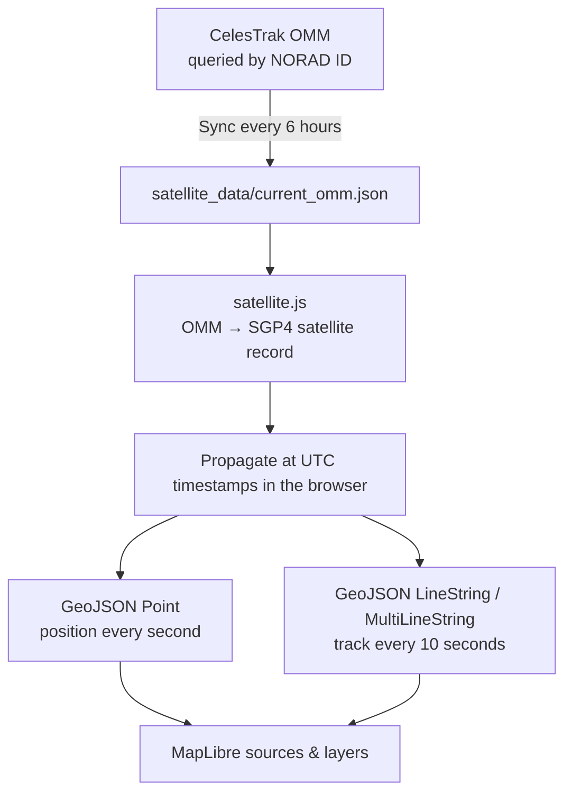

# 🛰️ Live JPSS Positions and Orbital Tracks

[ภาษาไทย](live_jpss.md) · **English**

> This document explains how the **JPSS Planning** web application retrieves current OMM data, propagates satellite positions with SGP4, and renders a separate orbital track for each satellite in MapLibre.

| Item | Contract |
|---|---|
| Satellites | Suomi-NPP · NOAA 20 (JPSS-1) · NOAA 21 (JPSS-2) |
| Orbital source | CelesTrak CCSDS OMM |
| Propagator | SGP4 through `satellite.js` 6.0.2 |
| Temporal reference | UTC |
| CRS | OGC:CRS84 |
| Coordinate order | `[longitude, latitude]` |
| Live positions | GeoJSON Point · refreshed every second |
| Orbital tracks | LineString/MultiLineString · rebuilt every 10 seconds |

## Contents

- [Data flow](#data-flow)
- [1. Orbital data source](#1-orbital-data-source)
- [2. Web snapshot contract](#2-web-snapshot-contract)
- [3. Position propagation](#3-position-propagation)
- [4. Per-satellite track generation](#4-per-satellite-track-generation)
- [5. MapLibre rendering](#5-maplibre-rendering)
- [6. Automated updates](#6-automated-updates)
- [7. Validation checklist](#7-validation-checklist)
- [Limitations](#-limitations)

## Data flow



> [!IMPORTANT]
> The displayed locations are **SGP4 model predictions**. They are not direct spacecraft telemetry or onboard GPS observations.

## 1. Orbital data source

The application uses CCSDS OMM (Orbit Mean-Elements Message) data from the CelesTrak General Perturbations API:

```text
https://celestrak.org/NORAD/elements/gp.php?CATNR={norad_id}&FORMAT=JSON
```

Three satellites are tracked:

| `satellite_id` | Display name | NORAD ID | Object ID |
|---|---|---:|---|
| `suomi_npp` | SUOMI NPP | 37849 | 2011-061A |
| `jpss_1` | NOAA 20 (JPSS-1) | 43013 | 2017-073A |
| `jpss_2` | NOAA 21 (JPSS-2) | 54234 | 2022-150A |

The synchronization logic is implemented in [`scripts/sync_jpss_current_omm.py`](scripts/sync_jpss_current_omm.py).

### OMM validation before publication

The synchronization script verifies the following conditions before publishing a snapshot:

- CelesTrak returns exactly one OMM record for each requested NORAD ID.
- `NORAD_CAT_ID` matches the requested satellite.
- Required orbital parameters are finite numbers.
- `MEAN_MOTION` is between 10 and 20 revolutions per day.
- `ECCENTRICITY` satisfies `0 ≤ e < 1`.
- `INCLINATION` is between 0° and 180°.
- The OMM epoch is not more than one hour in the future.
- The OMM record is not older than seven days.
- API requests retry up to three times for HTTP 429, 5xx, and network failures.

The JSON snapshot is published with an atomic file replacement so the web client does not read a partially written document.

## 2. Web snapshot contract

Validated records are written to [`satellite_data/current_omm.json`](satellite_data/current_omm.json):

```json
{
  "generated_at": "2026-08-23T16:49:28Z",
  "position_contract": {
    "method": "Browser-side SGP4 propagation from the latest OMM",
    "temporal_reference": "UTC",
    "crs": "OGC:CRS84",
    "coordinate_order": ["longitude", "latitude"],
    "altitude_unit": "km",
    "telemetry": false
  },
  "satellites": [
    {
      "satellite_id": "suomi_npp",
      "norad_id": 37849,
      "epoch_utc": "2026-08-23T07:14:55Z",
      "age_hours_at_sync": 9.58,
      "omm": {}
    }
  ]
}
```

The time fields have distinct meanings:

- `generated_at` is when the workflow created the static snapshot.
- `epoch_utc` or `omm.EPOCH` is the reference time of the CelesTrak orbital elements. It is not the current time.
- `calculated_at` is the timestamp at which the browser propagated the displayed position.

> [!TIP]
> To verify live tracking, watch `Calculated UTC` in the popup. It must advance every second. `OMM epoch` remains unchanged until a newer orbital-element set is synchronized.

## 3. Position propagation

The page loads `satellite.js` version 6.0.2 and performs these steps:

1. Fetch `satellite_data/current_omm.json`.
2. Require all three satellite records and an `OGC:CRS84` position contract.
3. Convert each `record.omm` to a satellite record with `satellite.json2satrec()`.
4. Run `satellite.propagate(satrec, date)` to obtain an ECI position at the requested UTC time.
5. Use Greenwich sidereal time to transform ECI into geodetic longitude, latitude, and altitude.
6. Validate the result before creating GeoJSON:
   - longitude: -180° to 180°
   - latitude: -90° to 90°
   - altitude: 100 to 2,000 km

The current position is propagated every second and represented as a GeoJSON Point:

```json
{
  "type": "Feature",
  "id": "suomi_npp",
  "properties": {
    "type": "live_satellite_position",
    "satellite_id": "suomi_npp",
    "calculated_at": "2026-08-23T18:03:43.670Z",
    "altitude_km": 830.6,
    "source": "CelesTrak OMM / SGP4"
  },
  "geometry": {
    "type": "Point",
    "coordinates": [120.1515, 38.1832]
  }
}
```

All client-generated GeoJSON uses CRS84 coordinate order: `[longitude, latitude]`.

### Satellite icon direction

The web client also propagates the position five seconds into the future. The initial bearing from the current position to that future position rotates the satellite icon in its direction of travel.

Bearing values are unwrapped between updates to prevent the icon from making a full reverse rotation when the heading crosses from 359° to 0°.

## 4. Per-satellite track generation

The live orbital tracks are not downloaded as line files. The browser builds one feature for each satellite from its OMM record:

1. Use the current time as the center time.
2. Start the track 10 minutes before the current time.
3. End the track 100 minutes after the current time.
4. Propagate a position at 15-second intervals.
5. Store each valid position as `[longitude, latitude]`.
6. Create one GeoJSON feature per satellite.
7. Rebuild the track collection every 10 seconds.

The controlling constants are defined in [`index.html`](index.html):

| Constant | Value | Purpose |
|---|---:|---|
| `LIVE_POSITION_INTERVAL_MS` | 1,000 ms | Point refresh interval |
| `LIVE_POSITION_LOOKAHEAD_MS` | 5,000 ms | Future position used for bearing |
| `LIVE_TRACK_PAST_MINUTES` | 10 minutes | Historical part of the track |
| `LIVE_TRACK_FUTURE_MINUTES` | 100 minutes | Predicted part of the track |
| `LIVE_TRACK_STEP_SECONDS` | 15 seconds | Sampling interval along the track |
| `LIVE_TRACK_REFRESH_MS` | 10,000 ms | Track rebuild interval |

Each orbital-track feature follows this structure:

```json
{
  "type": "Feature",
  "properties": {
    "type": "live_tle_track",
    "satellite_id": "suomi_npp",
    "satellite": "SUOMI NPP",
    "start_datetime": "...",
    "end_datetime": "...",
    "omm_epoch": "...",
    "source": "CelesTrak OMM / SGP4"
  },
  "geometry": {
    "type": "LineString",
    "coordinates": []
  }
}
```

When a track crosses the ±180° antimeridian, the client splits it into segments and emits a `MultiLineString`. This prevents MapLibre from drawing an incorrect line across the center of the world map.

> [!NOTE]
> The property name `live_tle_track` is retained for compatibility with the existing UI. The actual source is **OMM**, propagated with **SGP4**.

## 5. MapLibre rendering

The page maintains two in-memory GeoJSON sources:

| MapLibre source | Geometry | Responsibility |
|---|---|---|
| `jpss-live-positions` | Point | Current location, icon, and label |
| `jpss-live-tracks` | LineString/MultiLineString | Orbital track around the current time |

The display layers are:

- `live-satellite-track-line` renders the orbital tracks with a thin, low-opacity line.
- `live-satellite-anchor` provides a stable pointer target.
- `live-satellite-symbol` displays the SVG satellite icon and rotates it using the bearing.
- `live-satellite-label` displays NPP, JPSS-1, or JPSS-2.

Colors are selected by `satellite_id`, keeping each icon and its track visually linked:

- `suomi_npp` uses the NPP color.
- `jpss_1` uses the JPSS-1 color.
- `jpss_2` uses the JPSS-2 color.

Clicking an icon, label, or anchor opens a popup containing:

- `Calculated UTC`
- latitude and longitude
- altitude in kilometers
- direction in degrees
- source OMM epoch
- `Source: CelesTrak OMM`

## 6. Automated updates

The deployed repository contains `.github/workflows/sync-jpss-current-omm.yml`. It runs:

- every six hours at minute 17 UTC;
- manually through `workflow_dispatch`;
- after changes to the synchronization script or its workflow are pushed to `main`.

The workflow:

1. Installs Python 3.12 and `requests`.
2. Runs `python3 scripts/sync_jpss_current_omm.py`.
3. Commits and pushes only when `satellite_data` changed.
4. Triggers the GitHub Pages workflow after a successful OMM synchronization.

To refresh the snapshot locally:

```bash
python3 scripts/sync_jpss_current_omm.py
```

Inspect the resulting snapshot with:

```bash
python3 -m json.tool satellite_data/current_omm.json
```

## 7. Validation checklist

- [ ] `generated_at` belongs to the latest synchronization run.
- [ ] Every `epoch_utc` is no more than seven days old.
- [ ] Popup `Calculated UTC` advances every second and matches current UTC.
- [ ] Latitude is within -90° to 90° and longitude is within -180° to 180°.
- [ ] JPSS altitude is plausible for a low Earth orbit.
- [ ] Each icon remains aligned with the track of the same color at different zoom levels.
- [ ] Antimeridian crossings do not draw a line across the center of the map.
- [ ] Turning off `Live JPSS positions` hides points, icons, labels, and tracks together.

## ⚠️ Limitations

- Positions are predicted from OMM/SGP4, not measured telemetry.
- Accuracy degrades as the propagation time moves farther away from the OMM epoch.
- A one-second position refresh does not mean OMM data is downloaded every second.
- The browser must be able to load `satellite.js` from its CDN.
- If CelesTrak or GitHub Actions is unavailable, the site continues using the most recently deployed snapshot.
